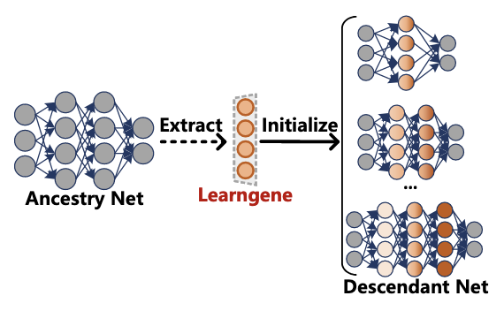
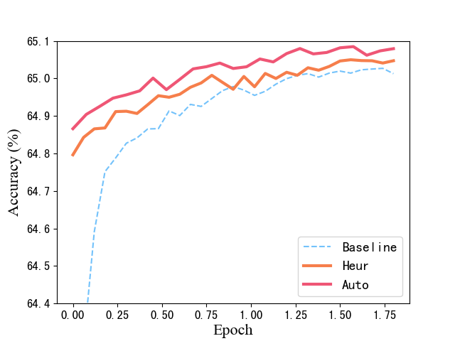
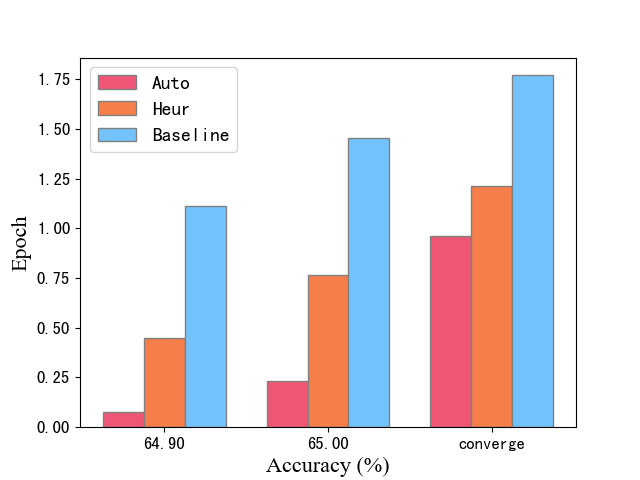
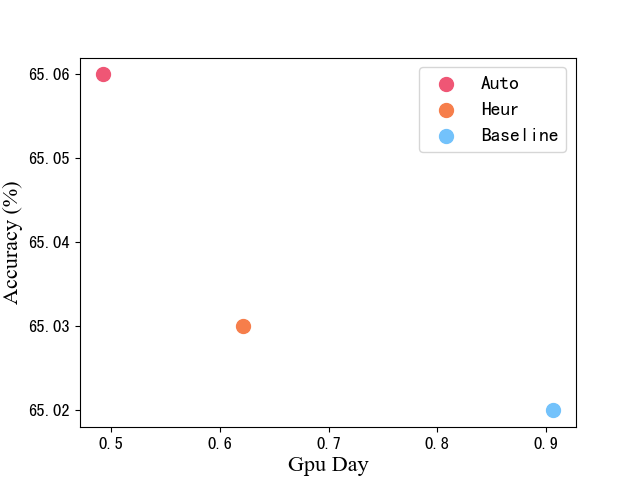
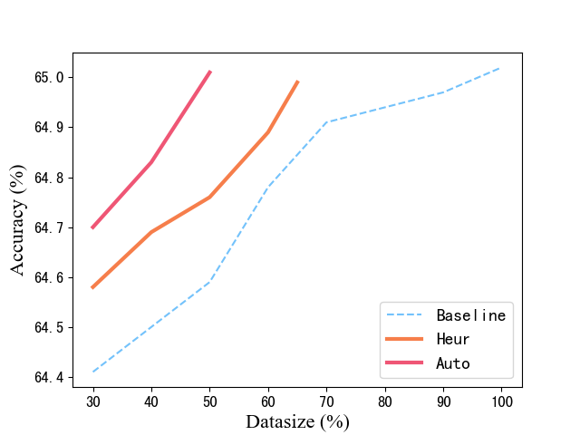

# YuanMou (元谋)

<p align="center">
  
</p>


## 项目介绍

YuanMou 是一个基于 PyTorch 的开源 **学习基因（learngene）** 工具箱。**学习基因** 是一种新颖的机器学习范式，其核心思想是首先将一个较大且经过良好训练的模型（称为 *祖先模型*）浓缩为一个微小但关键的部分，称为 *Learngene*，其中包含祖先模型的核心且可泛化的知识。随后，Learngene 可以扩展，用于初始化许多不同规模的模型，以适应不同的下游任务和资源限制，这些模型被称为 *后代模型*。

目前，YuanMou包括以下5种 **学习基因** 算法.

+ [Heur Learngene]( https://arxiv.org/abs/2106.06788): AAAI 2022
+ [Auto Learngene](https://arxiv.org/abs/2305.02279): arXiv prePrint 2023
+ [Learngene Pool](https://arxiv.org/abs/2312.05743): AAAI 2024
+ [TLEG](https://arxiv.org/abs/2312.05614): AAAI 2024
+ [SWS](https://arxiv.org/abs/2404.16897): IJCAI 2024

<p align="center">
  
</p>


## 项目优势

我们分别在当前广为人知的大型语言模型 [**Llama2-7B**](https://ai.meta.com/llama/) 上应用了Heur Learngene 和Auto Learngene, 并以原始的 [LoRa](https://arxiv.org/abs/2106.09685) 作为基线, 展示了 **学习基因** 具有以下优势：

+ ### 更好的模型表现

  通过采用Heur Learngene 和Auto Learngene，在大型语言模型上进行相同数量的训练轮次微调，可以带来性能提升。

<p align="center">
  
</p>


+ ### 更快的收敛速度

 通过采用Heur Learngene 和Auto Learngene，大型语言模型收敛所需的训练轮次分别减少了 **30%** 和 **40%** 。.

<p align="center">
  
</p>


+ ### 更少的GPU时间

 通过使用 Heur Learngene 和 Auto Learngene，对大型语言模型进行微调所需的 GPU 时间分别减少了 30% 和 40%，从而降低了资源成本。

<p align="center">
  
</p>


+ ### 更少的训练样本

  通过使用 Heur Learngene 和 Auto Learngene，对大型语言模型进行微调所需的训练数据量分别仅为 60% 和 50%，从而进一步降低了资源成本。

<p align="center">
  
</p>


## 开始训练！

以下提供一个在Llama2-7B上使Learngene Pool的样例，更多样例模板可参考 [examples](https://github.com/ZhenuYang/Yuanmou/tree/main/examples)

### 克隆项目

运行以下指令以克隆YuanMou项目并进入项目文件夹
```
git clone https://github.com/Learngene-YuanMou/YuanMou.git
cd YuanMou
```


### 配置环境

创建虚拟环境并安装项目所需要的第三方基础库
```
conda create -n YuanMou python=3.8
conda activate YuanMou
pip install -r requirements.txt
```


### 准备数据集

| 数据集        | 种类数      | 图像总数   | 链接                                                         |
| ------------- | ---------- | ---------- | ------------------------------------------------------------ |
| CIFAR-100     | 100        | 50,000     | https://www.cs.toronto.edu/~kriz/cifar-100-python.tar.gz     |
| Mini-ImageNet | 100        | 60,000     | https://github.com/twitter-research/meta-learning-lstm/tree/master/data/miniImagenet |
| ImageNet-1K   | 1000       | 14,197,122 | https://image-net.org/download.php                           |


#### 下载数据集

您可以从上方的链接或 Paddle 链接将数据集下载到数据目录中。这里我们以 CIFAR-100 为例。

```python
cd utils/datasets
wget https://www.cs.toronto.edu/~kriz/cifar-100-python.tar.gz
```


### Learngene Pool使用样例

Take Learngene Pool as an example. Note that you need to modify the `output_dir` and `data_path` in the `.yaml`.


#### Train and extract learngene

If we want to build the learngene pool with 18 instances, execute the following commands.

The learnegene extracted from the following line of code is deit_base9_patch16_224:

```python
cd learngene_methods/learngene_pool
python distill.py --config configs/conf_aux_base9.yaml
```

The default parameters of the experiment are shown in `configs/conf_aux_base9.yaml`. 

The learnegene extracted from the following line of code is deit_tiny9_patch16_224:

```python
cd learngene_methods/learngene_pool
python distill.py --config configs/conf_aux_tiny9.yaml
```

The default parameters of the experiment are shown in `configs/conf_aux_tiny9.yaml`. 


#### Build the learngene pool

In this section, we can construct the learngene pool from the extracted learngenes.

```python
cd learngene_methods/learngene_pool
python main.py --config configs/conf_build.yaml
```

The default parameters of the experiment are shown in `configs/conf_build.yaml`.


#### Initialize with learngene and test

In this section, we use learngene to initialize the descendant network and test the performence.

```python
cd learngene_methods/learngene_pool
python main.py --config configs/conf_ini.yaml
```

The default parameters of the experiment are shown in `configs/conf_ini.yaml`.

To build learngene pool and descendant models of different sizes, you only need to modify some hyper-parameters.


## License

This project is released under the [MIT license](https://github.com/Learngene-YuanMou/YuanMou/blob/master/LICENSE).


## Citations

If you use this toolbox in your research, please cite these papers.

<a name="HeurLearngene"></a>

```bibtex
@inproceedings{wang2021learngene,
   title={Learngene: From Open-World to Your Learning Task}, 
    author={Wang, Qiufeng and Geng, Xin and Lin, Shuxia and Xia, Shiyu and Qi, Lei and Xu, Ning},
   booktitle={AAAI}
   year={2022}
}
```

<a name="AutoLearngene"></a>

```bibtex
@misc{wang2023learngene,
      title={Learngene: Inheriting Condensed Knowledge from the Ancestry Model to Descendant Models}, 
     author={Qiufeng Wang and Xu Yang and Shuxia Lin and Jing Wang and Xin Geng},
     year={2023},
     eprint={2305.02279},
     archivePrefix={arXiv},
     primaryClass={cs.LG}
}
```

<a name="LearngenePool"></a>

```bibtex
@inproceedings{shi2024learngenepool,
  title={Building Variable-sized Models via Learngene Pool},
  author={Shi, Boyu and Xia, Shiyu and Yang, Xu and Chen, Haokun and Kou, Zhiqiang and Geng, Xin},
  booktitle={AAAI},
  year={2024}
}
```

<a name="TLEG"></a>

``` bibtex
@inproceedings{xia2024tleg,
  title={Transformer as Linear Expansion of Learngene},
  author={Xia, Shiyu and Zhang, Miaosen and Xu, Yang and Chen, Ruiming and Chen, Haokun and Xin, Geng},
  booktitle={AAAI},
  year={2024}
}
```


## Contacts

If you have any questions about our work, please do not hesitate to contact us by emails.

Wenxuan Zhu: zhuwx@seu.edu.cn

Yuankun Zu: zyk0418@seu.edu.cn


## Acknowledgements

Our project references the codes in the following repos.

+ [Heur Learngene](https://github.com/BruceQFWang/learngene)
+ [Deit](https://github.com/facebookresearch/deit)
